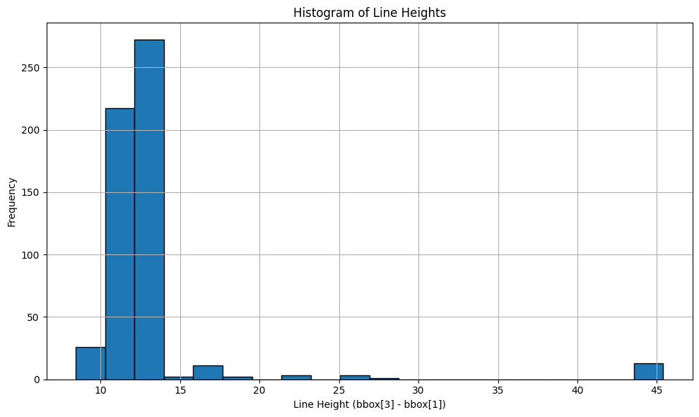
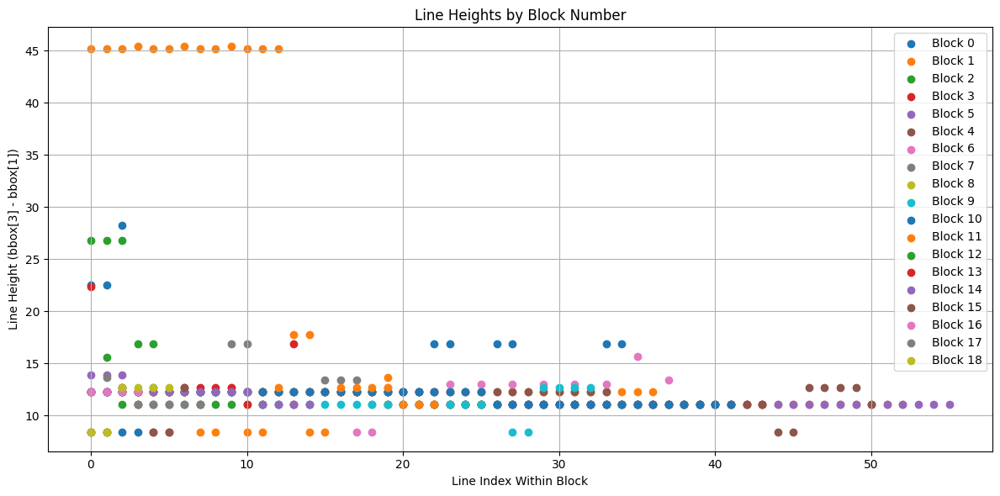
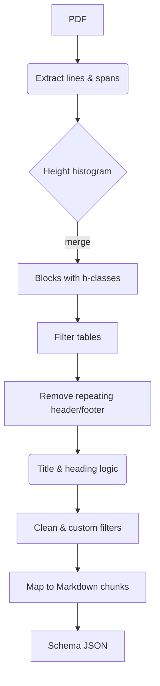

# PDF Structural Extraction – Adobe Hackathon Submission





---

## 1. Problem Statement
Reading long, visually–rich PDFs is hard for both humans and machines.  Heading hierarchies, repeated headers/footers and tables break naïve line-by-line extraction and traditional approaches frequently rely **only on font size** – a fragile signal that fails on scanned, multi-column or stylistically diverse documents.

Our goal: **Convert arbitrary PDFs into a clean JSON schema**
```json
{
  "title": "…",
  "outline": [ {"level": "H1|H2|H3", "text": "…", "page": n}, … ]
}
```
robustly, without depending solely on typography.

---

## 2. High-Level Approach
1. **Low-Level Parsing** – PyMuPDF (`fitz`) gives us every span/line/block with positions, size, font-face, bold/italic flags, etc.
2. **Semantic Grouping** – we merge spans into logical lines, then into blocks while tracking the geometric height of each line (`bbox`).
3. **Multi-Signal Heading Detection**  
   * Height histogram → candidate header classes `h1‥hN`  
   * **Bold-ness & position** heuristics break ties.  
   * Title chosen by combination of *page*, *y-coordinate* (< 60 % page height) **and** boldness – not raw size.
4. **Noise Removal**  
   * Repeated headers / footers detected by (text, page-frequency, y-zone) statistics.  
   * Table areas located with span-count heuristics and purged.  
   * Single-char, digits-only, punctuation-only blocks discarded.
5. **Content Grounding** – We re-map each heading back to the closest full-text chunk produced by our Markdown converter (`pymupdf_rag_original.py`) to guarantee semantic completeness – removing residual font-size dependence.
6. **JSON Translation** – height classes (`title`, `h1`, `h2` …) → schema levels (`H1`, `H2`, `H3`).
7. **Batch Utility** – `process_pdfs_directory` runs the full pipeline over a folder, writing results to `output_jsons/`.

---

## 3. Why We *Avoid* Relying on Font-Size Alone
Font size correlates with hierarchy **but is never sufficient**. We explicitly counter its pitfalls:

* **Boldness Check** – If an `h2` is bold and sits above a non-bold `h1`, we may promote it.
* **Positional Rules** – Headers expected near top of page; same font appearing mid-page is down-ranked.
* **Repetition Filter** – Constant font-size strings on every page are headers/footers, not document headings.
* **Table & Graphic Zones** – Tables often use body font size yet must be ignored; geometry–based table detection sidesteps size.
* **Chunk Remapping** – Final text is replaced by full paragraph chunks that *contain* all heading tokens irrespective of styling.

These layered checks let us survive scanned PDFs (uniform OCR font), multi-column brochures and design-heavy documents.

---

## 4. Pipeline Flowchart


---

## 5. Repository Layout
* `main_pipeline_pdfs.py` – orchestrates the end-to-end PDF → JSON conversion.
* `helpers/`
  * `get_text_lines.py` – natural line reconstruction.
  * `multi_column.py` – multi-column detection, returns ordered text boxes.
  * `progress.py` – lightweight CLI progress bar.
  * `pymupdf_rag_original.py` – battle-tested Markdown (RAG-friendly) extractor.
* `to_chunk_json.py` – utility to pre-chunk a PDF into clean text segments.
* `output_jsons/` – sample results.
* `graph1.png`, `graph2.png` – visual aids (placeholders above).

---

## 6. Installation
```bash
python -m venv venv
source venv/bin/activate  # Windows: venv\Scripts\activate
pip install -r requirements.txt  # see below
```
### Minimal requirements
```
PyMuPDF>=1.25.5
numpy
```

---

## 7. Docker Usage
The project includes a Dockerfile for containerized execution. This is the recommended approach for consistent environments.

### Prerequisites
- Docker Desktop installed and running
- PDF files placed in the `input/` directory

### Build and Run
From the project root directory:

```powershell
# Build the Docker image
docker build -t pdf-pipeline .

# Run the container (Windows PowerShell)
docker run --rm `
  --mount type=bind,source="${PWD}\input",target=/app/input `
  --mount type=bind,source="${PWD}\output",target=/app/output `
  pdf-pipeline
```

### Single-line command (Windows PowerShell)
```powershell
docker build -t pdf-pipeline .; docker run --rm --mount type=bind,source="${PWD}\input",target=/app/input --mount type=bind,source="${PWD}\output",target=/app/output pdf-pipeline
```

### Linux/macOS
```bash
# Build
docker build -t pdf-pipeline .

# Run
docker run --rm \
  -v "$(pwd)/input:/app/input" \
  -v "$(pwd)/output:/app/output" \
  pdf-pipeline
```

### What happens
1. The container processes all PDF files from the mounted `input/` directory
2. JSON output files are written to the mounted `output/` directory
3. The container is automatically removed after completion (`--rm` flag)

---

## 8. Usage
```python
from main_pipeline_pdfs import process_pdfs_directory

input_dir = "./sample_dataset/pdfs"
output_dir = "./output_jsons"
process_pdfs_directory(input_dir, output_dir)
```
The convenience CLI is commented in `main_pipeline_pdfs.py` – simply uncomment and run.

---

## 8. Extending / Tweaking
* **Bins for height histogram** – change `bins` in `process_pdf_to_json`.
* **Repeating header ratio** – tune `min_repeat_ratio` in `remove_repeated_headers_footers`.
* **Table span thresholds** – adjust `span_threshold`, `line_threshold`.
* **Custom levels** – map additional `hN` to schema by editing `translate_to_schema_format`.

---

## 9. Results
See `output_jsons/` for five real-world PDFs – each produced with zero manual cleaning.

---
